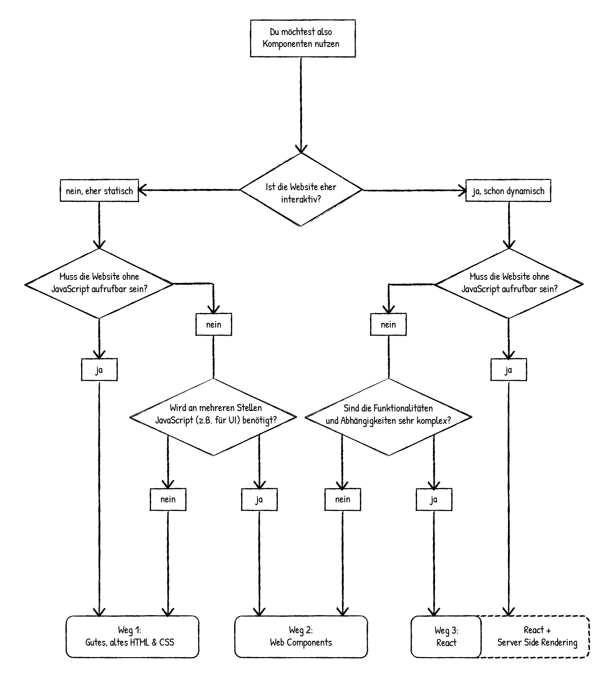

# Die Antwort

Wie zu Beginn schon gesagt, möchte ich nicht einen Weg hervorheben oder gar als _den Richtigen_ darstellen. Jede Technologie hat ihre eigenen Vor- und Nachteile, die je nach Projekt und Entwickler unterschiedlich stark sind.

Nachdem ich mich mit jeder Technologie einzeln auseinandergesetzt habe – Informationen zusammengetragen habe, Beispiele programmiert habe und zuletzt das zugehörige Kapitel dieser Arbeit geschrieben habe – dachte ich immer wieder, dass das nun _die Richtige_ Technologie sei. Jedes Mal war ich an einem Punkt angekommen, wo ich mir sicher war, dass ich nur sie in Zukunft nutzen wolle.

Somit habe ich einen einfachen Entscheidungsprozess entwickelt, der pro Projekt angewendet werden kann, sollte man wie ich bei der Entscheidung unentschlossen sein.

